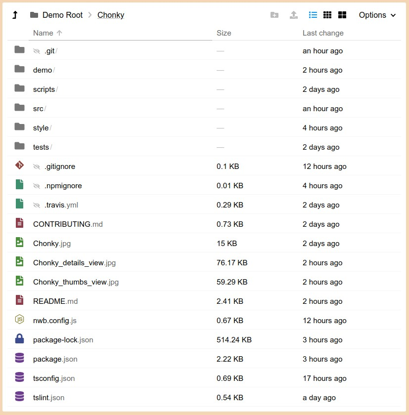
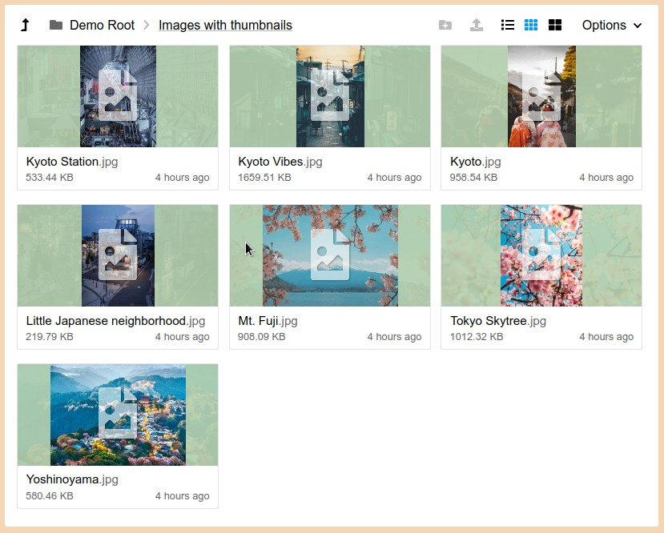

<p align="center">
  
</p>

[](https://www.npmjs.com/package/chonky)

# Introduction

> Chonky is still in development, use at your own risk.

Chonky is a file browser component for React. It tries to recreate the native file browsing experience in your browser.
This means your users can make selections, drag & drop files, toggle file view between "large thumbnails" and "detailed
list", enter folders, and so on. [Click here to see a demo.](https://timbokz.github.io/Chonky/)

What Chonky **does not** do is fetching information about the files. It is **your** responsibility to provide file
information, either by making Ajax request to your server, adding necessary FS logic to your Electron app or creating
some virtual FS inside your web application.

### Notable Chonky features:

* Lets users choose between 3 views: Details, medium thumbnails, large thumbnails.
* Supports file selection and drag & drop.
* Is file system agnostic - file data can come from any source as long as it follows the required format.
* Supports callbacks for entering folders and opening, deleting or moving multiple files.
* Supports async FS logic - via lazy loading and loading placeholders.
* Supports file sorting and text search.
* Supports [windowing](https://reactjs.org/docs/optimizing-performance.html#virtualize-long-lists) (a.k.a.
virtualization) for long file lists.
* Supports file thumbnails (e.g. generated from videos or images).
* Detects common file types, showing appropriate icons.

| Details view                                      |
|---------------------------------------------------|
|  |

| Thumbnail view                                     |
|----------------------------------------------------|
|  |

## Notes

* It's a good idea to ask your users for confirmation before doing any FS manipulations in file operation handlers. 
For example, you could show a confirm dialog asking "Are you sure?" before moving or deleting files.


## Install

```bash
npm install --save chonky
```

## Usage

```tsx
import * as React from 'react';

import {FileBrowser} from 'chonky';

class Example extends React.Component {
    render() {
        return (
            <FileBrowser fileMap={{}} fileIds={[]}/>
        );
    }
}
```

## License

MIT © [TimboKZ](https://github.com/TimboKZ)